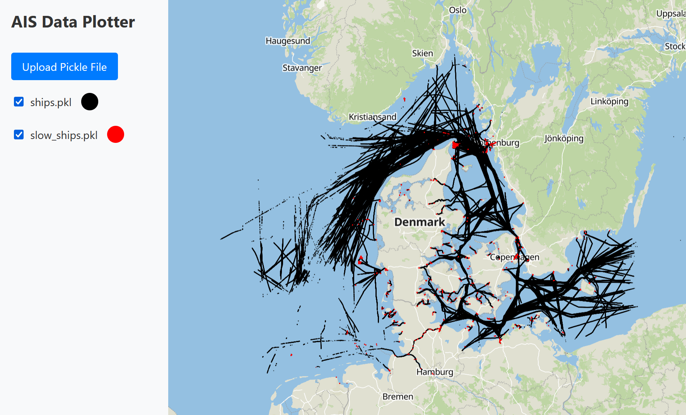

# AIS Data Plotter

**AIS Data Plotter** is an interactive web application for visualizing AIS (Automatic Identification System) data for ships. This tool enables users to dynamically upload and visualize ship position data from `.pkl` files on a map, with customizable color options for different datasets. The frontend is built with **Svelte**, **MapLibre GL**, and **TypeScript**, while the backend uses **FastAPI**.

## Features

- **Interactive Map Visualization**: Displays real-time ship positions on an interactive map using **MapLibre GL**, allowing users to explore ship data visually.
- **Dynamic Data Upload and Layered Plotting**: Supports the upload of multiple `.pkl` files with AIS data, dynamically adding each as a new layer on the map. Users can toggle individual layers on and off, adjusting visibility without reloading the page.
- **Color Customization**: Each uploaded dataset can be assigned a unique color using an integrated **color picker**, making it easy to distinguish between multiple datasets.
- **TypeScript and Strong Typing**: The frontend is implemented in **TypeScript**, ensuring type safety and improving maintainability.
- **Svelte for Efficient UI Updates**: The **Svelte** framework facilitates a reactive UI, so map layers, colors, and visibility options update instantly when modified by the user.
- **Backend with FastAPI**: A **FastAPI** server handles file uploads and data processing, parsing AIS data from `.pkl` files and returning formatted JSON data for visualization.
- **CORS Configuration**: **CORS** is configured to allow secure communication between the frontend and backend servers, enabling flexible deployment scenarios.

